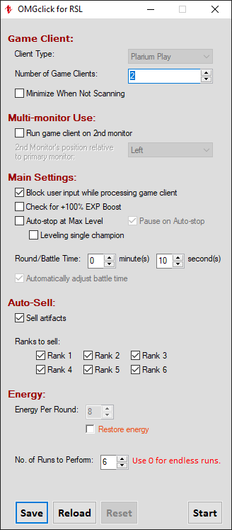

# **OMGclick** for *Raid: Shadow Legends* (Desktop Clients)

## Table of Contents

+ [Overview](#Overview)
+ [Configuration](#Configuration)
  + [Game Client](#Game-Client)
  + [Multi-monitor Use](#Multi-monitor-Use)
  + [Main Settings](#Main-Settings)
  + [Auto-Sell](#Auto-Sell)
  + [Energy](#Energy)
+ [Usage](#Usage) - *Read this before using*
+ [Caveats](#Caveats)

## [Overview]

This [auto clicker] was written using **AutoHotkey**, but its aim is to be more than a simple "replay" script, automating other aspects of the tedious and repetitive task of grinding. While most auto clickers simply spam keys or mouseclicks to replay a battle for you, this one seeks to replicate the game's Multi-Battle system but without the added monthly cost and without any imposed limits to the number of battles available...aside from how much energy you can afford to spend. 

While there are several features already in place, this is still what I would consider in a *beta* stage, with a number of other features currently disabled in the UI and/or still being developed. Refer to the changelog for information on features being developed.

If you've made it this far, thank you. I look forward to reading your feedback and working together. Look below for information on how to use this program. For those who prefer video instructions over those in text form, that will be coming soon.

## [Configuration]

Rather than having you mess with a config file, I've designed a simple user interface (UI). The options should be relatively straightforward if you're already familiar with the game's Multi-Battle option.

### [Game Client]

**NOTE:** This only works with Plarium Play for now. Support for BlueStacks, NoxPlayer, LD Player, and other clients *will* eventually be supported as well...kinda just depends on if user demand dictates it.

**Number of Game Clients** Set this to the number game clients you have running. Unless you're multi-boxing, you'll likely only ever need to set this to **1**. I haven't personally tested this, but theoretically, this program should be able to support up to 99 simultaneous clients. Whether or not your computer can is a different story.

**Minimize when not scanning**: this will hide the game client windows when they're not being processed. This option is handy for those of you who might want to do other stuff on your computer while letting this program do its thing.

### [Multi-monitor Use]

If you have more than one monitor, you may enable this option to have OMGclick automatically move the game client window(s) to your second monitor. 

### [Main Settings]

**Block user input while processing game client** will prevent you from sending accidental commands (i.e. keystrokes and mouseclicks) to the game client(s).

**Check for +100% EXP Boost** will prompt you if it detects that 100% EXP boost isn't active. You will be given the option to stop the grind session so you can refresh the boost or you may continue without it.

**Auto-stop at Max Level** will automatically stop the grind session for the client and return to the "Edit Team" screen to allow you to replace your food champs with fresh ones.

**Pause on Auto-stop** will pause the program when a client has max level champions. Use this when you want the program to stop checking the game client(s) when one of them has max level champions. Note that this will halt all running sessions for other clients as well.

**Leveling single champion** should be enabled when solo-leveling a champion (i.e. the champion all by him/herself).

**Round/Battle Time** this is the scan interval and does not necessarily need to match your actual run time. The greater the interval, the more time between checks for the end battle screen. If you're using your computer at the same time, a longer interval may help with minimizing interruptions. You can also set a short interval to repeatedly check the game client(s). It's recommended that you avoid short intervals while using the *minimize* setting, however, as rapid repeated switching of game clients can lead to visual/rendering glitches that will cause problems for the program.

### [Auto-Sell]

**Sell artifacts** this is currently only set to detect *Curing* artifacts from level 12 of the campaign. Future releases will include detection for other levels and dungeons and their respective artifact sets.

**Ranks to sell** lets you select which artifact ranks to sell. Unselected ranks will be kept, of course.

### [Energy]

**Restore Energy** will automatically purchase energy refills for you; otherwise, the program will wait for enough energy to be restored to continue.

**No. of runs to perform** allows you to set a limit to the number of runs to be executed by the program. At this time, this is a global setting that affects all running clients. Setting this to **10**, for example, will perform 10 battles on each client before stopping.

## [Usage]

Launch OMGclick at any time you wish to use it, even while in the middle of a battle.

**NOTE:** OMGclick resizes (and repositions) game client windows to a particular size. As such, it is necessary to switch out of fullscreen mode (Fullscreen windowed mode is OK) when using OMGclick (at least until I figure out how to detect it and perform the resize as needed). While running, if it detects any change to the window size, OMGclick will again resize and reposition the window.

Just like the in-game Multi-Battle option, once you have your team set up and the settings in OMGclick set up how you like them, click on the **Start** button to begin. If you're in the middle of a battle, that's OK, too.

OMGclick creates an INI file called **OMGclick.ini** in the same folder as **OMGclick.exe**. Any settings saved via clicking on the **Save** button are written to this file. Making changes to the settings while OMGclick is running shouldn't cause any issues; however, I still do recommend pausing the program before making any changes.

OMGclick uses your game client's Process ID (PID) as a unique identifier rather than relying on its window title. This is how it's able to handle multiple clients. As such, whenever restarting or launching additional clients, you will need to click on the [**Reload**] button to capture the new client PID's. *Note that any settings not saved with the **Save** button are not restored after reloading.**

## [Caveats]

When using OMGclick with multiple clients, clients are initially processed from the bottom up. If you wish to run OMGclick with a different client count than are actually running (e.g. setting number of clients to 3 but having 4 running), make sure that the one(s) you want OMGclick to "ignore" are the ones most-recently active. So in the previously-mentioned example, the one to be ignored would either be currently active (selected) or have been the most-recently active before switching to some other window. Under most circumstances, this is a non-issue, but I felt it relevant for some users as I tend to do this myself when working on an account that's not "farming".