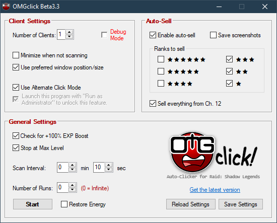

# **OMGclick** for *Raid: Shadow Legends* (Desktop Clients)

## Table of Contents

+ [Overview](#Overview)
+ [Configuration](#Configuration)
  + [Client Settings](#Client-Settings)
  + [Auto-Sell](#Auto-Sell)
  + [General Settings](#General-Settings)
+ [Usage](#Usage) - *Read this before using*
+ [Caveats](#Caveats)
+ [Donate](#Donate)

## [Overview]

### [Download Latest Version](https://github.com/omgmarc/OMGclick-Public/releases)

This auto clicker was written using **AutoHotkey**, but its aim is to be more than a simple "replay" script by automating other aspects of the tedious and repetitive task of grinding for EXP and gear in Raid: Shadow Legends. While most auto clickers simply spam keys or mouseclicks to replay a battle for you, this one seeks to replicate the game's in-built Multi-Battle system but without any imposed limits to the number of battles available...aside from how much energy you can afford to spend. 

Please do bear in mind that this is really just a hobby at this point and is still what I would consider in a *beta* stage. There are a number of features being developed, so updates and changes are bound to happen frequently and at times sporadically. My primary focus will be to fix any major bugs, but I also try to release at least one new feature with each bugfix, even if it's not something very major.

Anyhow, if you've made it this far, thank you. I look forward to reading your feedback and working together in making this the best it can be or at least as good as I can make it. Look below for information on how to use this program. For those who prefer video instructions over ones in text form, that will be coming soon, too.

## [Configuration]

Rather than having you mess with a config file, I've designed a simple user interface (UI). The options should be relatively straightforward if you're already familiar with the game's Multi-Battle option.

### [Client Settings]

**NOTE:** This only works with Plarium Play for now. Support for BlueStacks, NoxPlayer, LD Player, and other clients *will* eventually be supported as well...kinda just depends on if user demand dictates it and how soon I can work out the major bugs in the current versions.

**Number of Game Clients** Set this to the number game clients you have running. Unless you're multi-boxing, you'll likely only ever need to set this to **1**. I haven't personally tested this, but theoretically, this program should be able to support up to 99 simultaneous clients. Whether or not your computer can is a different story.

**Minimize when not scanning**: this will hide the game client windows when they're not being processed. This option is handy for those of you who might want to do other stuff on your computer while letting this program do its thing.

**Block user input while processing game client** will prevent you from sending accidental commands (i.e. keystrokes and mouseclicks) to the game client(s). You will need to run this program as Admin in order to use this option (it's a limitation in Windows). To do so, right click on the program, and select "Run as Administrator," then hit OK in the dialogue box that appears.

### [Auto-Sell]

**Enable Auto-Sell** Detect artifacts in the post-battle screen and sell or keep them based on the filters users.

**Ranks to sell** lets you select which artifact ranks to sell. Unselected ranks will be kept, of course.

**Sell everything from Ch. 12** lets you farm 12-3, for example, and sell all the Curing artifacts without having to touch the filters.

### [General Settings]

**Check for +100% EXP Boost** will prompt you if it detects that 100% EXP boost isn't active. You will be given the option to stop the grind session so you can refresh the boost or you may continue without it.

**Auto-stop at Max Level** will automatically stop the grind session for the client and return to the "Edit Team" screen.

**Scan Interval** (formerly called "Round/Battle Time"): this is the scan interval and does not necessarily need to match your actual run time. The greater the interval, the more time between checks for the end battle screen. If you're using your computer at the same time, a longer interval may help with minimizing interruptions. You can also set a short interval to repeatedly check the game client(s). It's recommended that you avoid really short intervals while using the *minimize* setting, as rapid repeated switching of game clients can lead to visual/rendering glitches that will cause problems for the program.

**No. of runs to perform** allows you to set a limit to the number of runs to be executed by the program. At this time, this is a global setting that affects all running clients. Setting this to **10**, for example, will perform 10 battles on each client before stopping.

**Restore Energy** will automatically purchase energy refills for you; otherwise, the program will wait for enough energy to be restored to continue.

## [Usage]

Launch OMGclick at any time you wish to use it, even while in the middle of a battle.

**NOTE:** OMGclick resizes (and repositions) game client windows to a particular size. As such, it is necessary to switch out of fullscreen mode (Fullscreen windowed mode is OK) when using OMGclick (at least until I figure out how to detect it and perform the resize as needed). While running, if it detects any change to the window size, OMGclick will again resize and reposition the window.

Just like the in-game Multi-Battle option, once you have your team set up and the settings in OMGclick set up how you like them, click on the **Start** button to begin. If you're in the middle of a battle, that's OK, too.

OMGclick creates an INI file called **OMGclick.ini** in the same folder as **OMGclick.exe**. Any settings saved via clicking on the **Save** button are written to this file. Making changes to the settings while OMGclick is running shouldn't cause any issues; however, I still do recommend pausing the program before making any changes.

OMGclick uses your game client's Process ID (PID) as a unique identifier rather than relying on its window title. This is how it's able to handle multiple clients. As such, whenever restarting or launching additional clients, you will need to click on the [**Reload**] button to capture the new client PID's. *Note that any settings not saved with the **Save** button are not restored after reloading.**

## [Caveats]

When using OMGclick with multiple clients, clients are initially processed from the bottom up. If you wish to run OMGclick with a different client count than are actually running (e.g. setting number of clients to 3 but having 4 running), make sure that the one(s) you want OMGclick to "ignore" are the ones most-recently active. So in the previously-mentioned example, the one to be ignored would either be currently active (selected) or have been the most-recently active before switching to some other window. Under most circumstances, this is a non-issue, but I felt it relevant for some users as I tend to do this myself when working on an account that's not "farming".

## [Donate]

I just want to thank you all for finding great use of my little program. A special thank you also goes out to those of you who felt the urge the shoot me a few bucks here and there to show your support. While I do not expect this from anyone, for others who may also feel the same way, you are welcome [to help keep my coffee supply topped off via Paypal](https://www.paypal.com/cgi-bin/webscr?cmd=_donations&business=VUVL2RPM5TLUC&currency_code=USD&source=url). Again, thank you for using my auto-clicker, and thank you for any donations. Have a wonderful day, and be safe out there.

