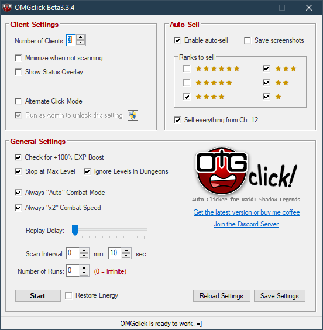

# **OMGclick** for *Raid: Shadow Legends* (Desktop Clients)

## Table of Contents

+ [Overview](#Overview)
+ [Support this Project](#Support-this-Project)
+ [Configuration](#Configuration)
  + [Client Settings](#Client-Settings)
  + [Auto-Sell](#Auto-Sell)
  + [General Settings](#General-Settings)
+ [Usage](#Usage) - *Read this before using*
+ [Caveats](#Caveats)

## [Overview]

**[Download Latest Version from the Discord server](https://discord.gg/RBzHB5n)**, and sign up to be be notified whenever new versions are released.

This auto clicker was written using **AutoHotkey**, but its aim is to be more than a simple "replay" script by automating other aspects of the tedious and repetitive task of grinding for EXP and gear in Raid: Shadow Legends. While most auto clickers simply spam keys or mouseclicks to replay a battle for you, this one seeks to replicate the game's in-built Multi-Battle system but without any imposed limits to the number of battles available...aside from how much energy you can afford to spend. 

Please do bear in mind that this is really just a hobby at this point and is still what I would consider in a *beta* stage. There are a number of features being developed, so updates and changes are bound to happen frequently and at times sporadically. My primary focus will be to fix any major bugs, but I also try to release at least one new feature with each bugfix, even if it's not something very major.

Anyhow, if you've made it this far, thank you. I look forward to reading your feedback and working together in making this the best it can be or at least as good as I can make it. Look below for information on how to use this program. For those who prefer video instructions over ones in text form, that will be coming soon, too.

## [Support this Project]

I wish to give a special thank you to those of you who've chosen to toss a few bucks my way to show your support and appreciation for the work I've put into this project. If you would also like to support the project, you can now [do so on Patreon](https://www.patreon.com/OMGclick). Doing so provides you with access to the development process, access to upcoming features and early releases, a say in the direction of the project, and more. If you prefer to do a one-time donation instead, you can [help keep my coffee supply topped off via Paypal](https://www.paypal.com/cgi-bin/webscr?cmd=_donations&business=VUVL2RPM5TLUC&currency_code=USD&source=url). Again, thank you for using my humble little script, and have yourself a safe and wonderful day.

Happy raiding!

## [Configuration]

Rather than having you mess with a config file, I've designed a simple user interface (UI). The options should be relatively straightforward if you're already familiar with the game's Multi-Battle option.

**NOTE:** This only works with Plarium Play for now. Support for BlueStacks, NoxPlayer, LD Player, and other clients *will* eventually be supported as well...kinda just depends on if user demand dictates it and how soon I can work out the major bugs in the current versions.

### [Client Settings]

**Number of Game Clients** Set this to the number game clients you have running. Unless you're multi-boxing, you'll likely never need to set this to anything other than 1.

**Minimize when not scanning**: this will hide the game client when not being processed.

**Block user input while processing game client** will prevent you from sending accidental commands (i.e. keystrokes and mouseclicks) to the game client(s). You will need to run this program as Admin in order to use this option (it's a limitation in Windows). Click on the little shield icon to relaunch the program as Admin if you wish to enable this setting. If at any point you need to regain control while locked out, press CTRL+ALT+DEL (then click Cancel) to override this setting.

### [Auto-Sell]

**Enable Auto-Sell** Detect artifacts in the post-battle screen and sell or keep them based on the filters users.

**Ranks to sell** lets you select which artifact ranks to sell. Unselected ranks will be kept, of course.

**Sell everything from Ch. 12** lets you farm 12-3, for example, and sell all the Curing artifacts without having to touch the filters.

### [General Settings]

**Check for +100% EXP Boost** will prompt you if it detects that 100% EXP boost isn't active. You will be given the option to stop the grind session so you can refresh the boost or you may continue without it. Note that continuing without boost disable this setting.

**Stop at Max Level** will automatically stop the grind session for the client and return to the "Edit Team" screen. If any other clients are still running, you can resume the client simply replacing max level champs with new ones and manually starting the first battle. The program will automatically resume replaying. If all clients hit max level, the program will automatically halt all clients sessions.

**Ignore Levels in Dungeons** will allow you to run dungeons without having to toggle the "Stop at Max Level" option off, allowing you to switch between grinding EXP in 12-3 Brutal, for example, and gear in dungeons without changing any settings. This is particularly useful when running multiple clients through different content simultaneously.

**Always "Auto" Combat Mode** will automatically enable "Auto" combat in battles. **Always "x2" Combat Speed** will automatically enable "x2" speed in battles. On their own, these options are not particularly special, but they *can* come in handy if you're fighting in the arena and always "auto" battling.

**Replay Delay** This slider will give you the option to set a brief wait period before starting the next battle. This is handy in case you want to have time to manually stop the program. Do note that if you have user inputs blocked, you will not be able to interrupt the process until the program restores user input (or you perform a CTRL+ALT+DELETE to bypass the lock).

**Scan Interval** (formerly called "Round/Battle Time"): this is the scan interval and does not necessarily need to match your actual run time. The greater the interval, the more time between checks for the end battle screen. If you're using your computer at the same time, a longer interval may help with minimizing interruptions. You can also set a short interval to repeatedly check the game client(s). It's recommended that you avoid really short intervals while using the *minimize* setting, as rapid repeated switching of game clients can lead to visual/rendering glitches that will cause problems for the program.

**Number of runs** allows you to set a limit to the number of runs to be executed by the program. At this time, this is a global setting that affects all running clients. Setting this to **10**, for example, will perform 10 battles on each client before stopping.

**Restore Energy** will automatically consume energy refills in your inventory and use gems to purchase energy refills. Do take into consideration how fast your runs are. With this setting enabled, you can easily burn through all your gems. It's recommended that you either set the number of runs you wish to perform and/or to preload your energy beforehand.

## [Usage]

Launch OMGclick at any time you wish to use it, even while in the middle of a battle.

**NOTE:** OMGclick resizes (and repositions) game client windows to a particular size. As such, it is necessary to switch out of fullscreen mode (Fullscreen windowed mode is OK) when using OMGclick (at least until I figure out how to detect it and perform the resize as needed). After the window is resized, you're free to reposition wherever you prefer so long as no portion of the window is off-screen. While scanning, if it detects any change to the window size, OMGclick will again resize and reset the window position.

Just like the in-game Multi-Battle option, once you have your team selected and the settings in OMGclick set up how you like them, click on the **Start** button to begin. If you're in the middle of a battle, that's OK, too.

OMGclick creates an INI file called **OMGclick.ini** in the same folder as **OMGclick.exe**. Any settings saved via clicking on the **Save** button are written to this file. Making changes to the settings while OMGclick is running shouldn't cause any issues; however, I still do recommend pausing the program before making any changes.

OMGclick uses your game client's Process ID (PID) as a unique identifier rather than relying on its window title. This is how it's able to handle multiple clients. If you launch additional clients, changing the number of clients setting will cause OMGclick to rescan all clients for new PIDs. However, when relaunching a client that might have crashed or required a relog, you will need to manually trigger a PID rescan by clicking the [Reload] button. All settings will be saved automatically.

## [Caveats]

When using OMGclick with multiple clients, clients are initially processed from the bottom up. If you wish to run OMGclick with a different client count than are actually running (e.g. setting number of clients to 1 but having 2 running), make sure that the one(s) you want OMGclick to "ignore" are the ones most-recently active. So in the previously-mentioned example, the one to be ignored would either be currently active (selected) or have been the most-recently active before switching to some other window that's **NOT** the client you wish to be scanned. Under most circumstances, this is a non-issue, but I felt it relevant for some users as I tend to do this myself when working on an account that's not "farming".

